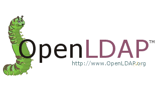

# Usuarios, grupos y ACLs en LDAP

#### En esta práctica vamos a trabajar con usuarios, grupos y ACLs en LDAP pero antes vamos a configurar LDAPs para que la conexión sea mas segura.

> NOTA: Si quieres saber como instalar y configurar LDAP con tu dominio y tus datos [haz click aquí](https://github.com/MoralG/Trabajando_con_LDAP/blob/master/Instalacion_Configuracion_LDAP.md#instalacion-y-configuracion-de-ldap)

### [Tarea de LDAPs](https://github.com/MoralG/Trabajando_con_LDAP/blob/master/Configuracion_de_LDAPs.md#configuraci%C3%B3n-de-ldaps)

------------------------------------------------------------

#### Configura el servidor LDAP de croqueta para que utilice el protocolo ldaps:// a la vez que el ldap:// utilizando el certificado x509 de la práctica de https o solicitando el correspondiente a través de gestiona.
#### Realiza las modificaciones adecuadas en el cliente ldap de croqueta para que todas las consultas se realicen por defecto utilizando ldaps://

### [Tareas a realizar con usuarios, grupos y ACLs](https://github.com/MoralG/Trabajando_con_LDAP/blob/master/Usuarios_grupos_ACLs.md#usuarios-grupos-y-acls-en-ldap):
------------------------------------------------------------
#### 1. [Creación de unidades organizativas](https://github.com/MoralG/Trabajando_con_LDAP/blob/master/Usuarios_grupos_ACLs.md#1-creaci%C3%B3n-de-unidades-organizativas). Vamos a creear 2 unidades organizativas, una para los grupos 'ou=Group' y otra para los usuarios 'ou=People'

#### 2. [Creación de usuarios](https://github.com/MoralG/Trabajando_con_LDAP/blob/master/Usuarios_grupos_ACLs.md#3-creaci%C3%B3n-de-usuarios). Crea 10 usuarios con los nombres que prefieras en LDAP, dentro de una unidad organizativa. Esos usuarios deben ser objetos de los tipos posixAccount e inetOrgPerson. Estos usuarios tendrán un atributo userPassword.

#### 3. [Creación de grupos](https://github.com/MoralG/Trabajando_con_LDAP/blob/master/Usuarios_grupos_ACLs.md#2-creaci%C3%B3n-de-grupos). Crea 3 grupos en LDAP, dentro de una unidad organizativa, que sean objetos del tipo groupOfNames. Estos grupos serán: comercial, almacen y admin.

#### 4. [Añadiendo usuarios](https://github.com/MoralG/Trabajando_con_LDAP/blob/master/Usuarios_grupos_ACLs.md#4-a%C3%B1adiendo-usuarios). Añade usuarios que pertenezcan a:
* Solo al grupo comercial
* Solo al grupo almacen
* Al grupo comercial y almacen
* Al grupo admin y comercial
* Solo al grupo admin

#### 5. [Modificar OpenLDAP con memberOf](https://github.com/MoralG/Trabajando_con_LDAP/blob/master/Usuarios_grupos_ACLs.md#5-modificar-openldap-con-memberof). Modifica OpenLDAP apropiadamente para que se pueda obtener los grupos a los que pertenece cada usuario a través del atributo "memberOf"

#### 6. [Creación de las ACLs 1](https://github.com/MoralG/Trabajando_con_LDAP/blob/master/Usuarios_grupos_ACLs.md#6-creaci%C3%B3n-de-las-acls-1). Crea las ACLs necesarias para que los usuarios del grupo almacen puedan ver todos los atributos de todos los usuarios pero solo puedan modificar las suyas

#### 7. [Creación de las ACLs 2](https://github.com/MoralG/Trabajando_con_LDAP/blob/master/Usuarios_grupos_ACLs.md#7-creaci%C3%B3n-de-las-acls-2). Crea las ACLs necesarias para que los usuarios del grupo admin puedan ver y modificar cualquier atributo de cualquier objeto